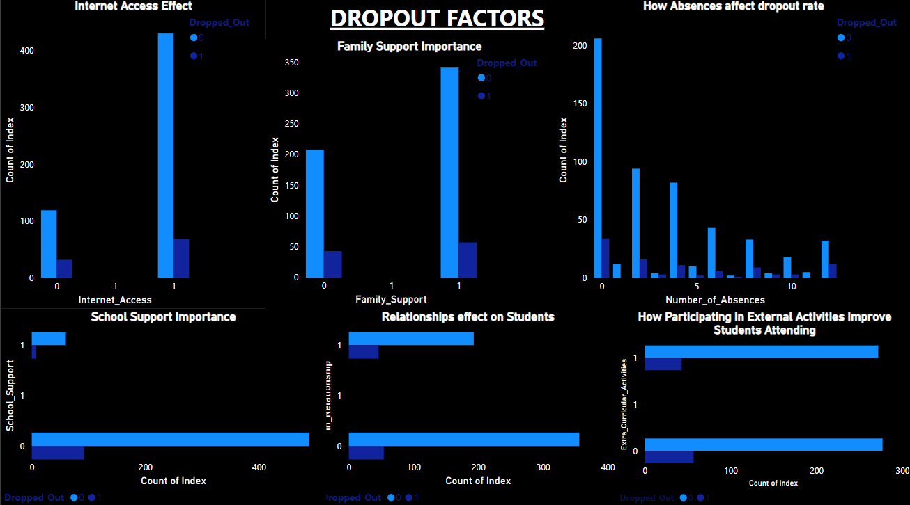
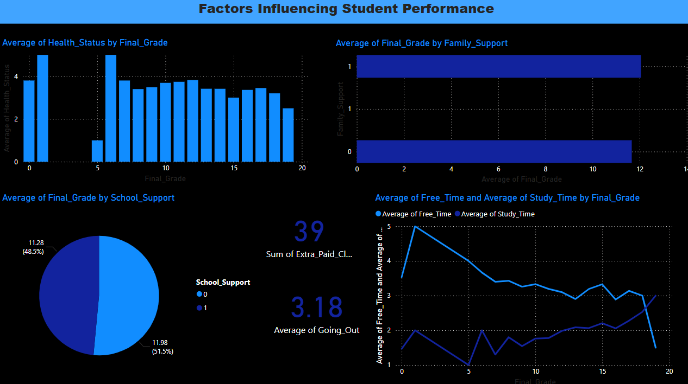
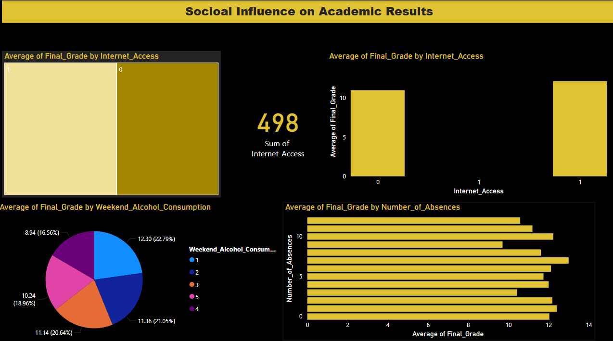

# Student Dropout Prediction

## Project Overview

Thousands of students silently drop out every year. What if we could predict who's next — and intervene early?

This project uses a real-world educational dataset and machine learning to **predict student dropout risk**, understand underlying patterns, and help institutions **take action** through data-driven dashboards and alerts.

---

## Tools Used

- **Python** (Pandas, Scikit-learn, Seaborn, Matplotlib, Joblib)
- **SQL Server** (for insight extraction and queries)
- **Power BI** (for stakeholder dashboards)
- **Google Slides** (for final storytelling presentation)

---

##  Dataset Details

- **Source:** Kaggle
- **Records:** 649 students
- **Target Variable:** `Dropped_Out` (0 = Stayed, 1 = Dropped Out)

###  Features:
- **Demographics:** Gender, Parents' Education
- **Academic:** GPA, Study Time, Number of Failures
- **Behavioral:** Absences, Internet Access, Extra Activities

---

##  Data Cleaning & Preprocessing

- One-Hot Encoding for categorical data
- Binary encoding for Yes/No values
- Capped outliers in `Absences` column
- Stratified train-test split (80/20)

---

## Model Building

| Model              | Accuracy | Notes                      |
|-------------------|----------|----------------------------|
| Logistic Regression | 97%      | Interpretable, simple      |
| Random Forest       | 100%     | Possible overfitting       |

- Evaluation: Confusion Matrix, Classification Report
- Final model saved using `joblib`

---

## Feature Importance (Top Predictors)

1. Final Grade (GPA)
2. Number of Absences
3. Mother's Education Level
4. Number of Past Failures
5. Study Time per Week

---

## Power BI Dashboards

### Dashboard 1&2: Behavioral Factors

### Dashboard 3: Academic

### Dashboard 4: Demographics

Key SQL-based questions answered:
- Dropout rate by gender and study time
- Impact of parental education
- How absences and extracurriculars affect dropout
- GPA thresholds linked to dropout risk
